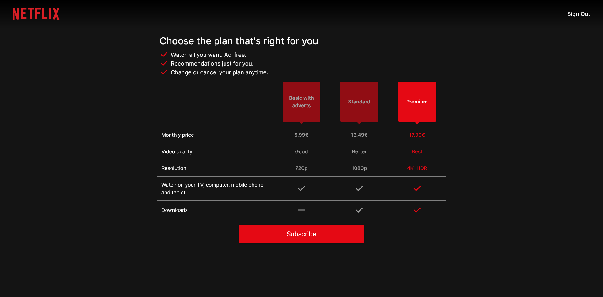
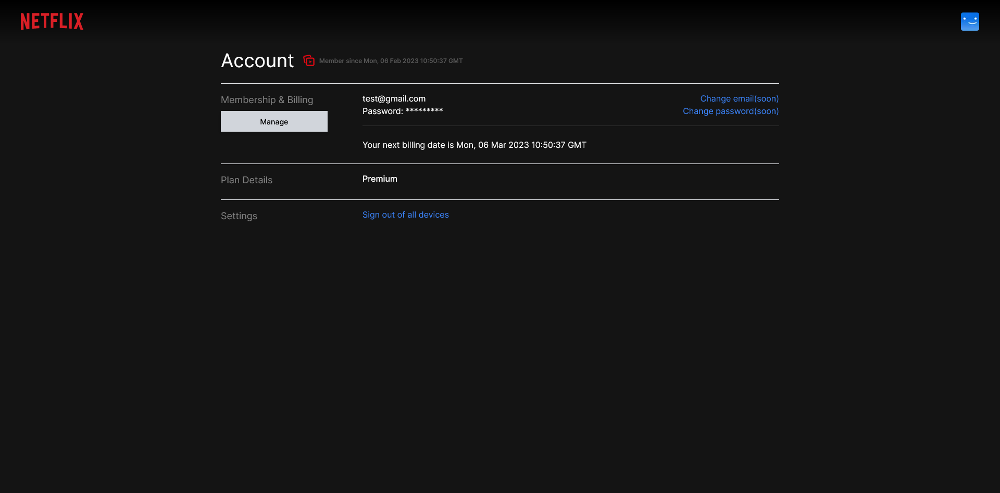

## Netflix Clone
C:\Users\caius\Documents\github\netflix\public\iconNetflix.png
Technologies:
- NextJS 
- TailwindCSS
- TypeScript
- Firebase
- Stripe
- Recoil
- Material UI

## ScreenShots

&ensp;

&ensp;

## Subscription with Stripe

Card number: 4242 4242 4242 4242 
Expiration: any 
CVC: any

## Thanks https://www.youtube.com/@ilwyennefer for guidelines.
